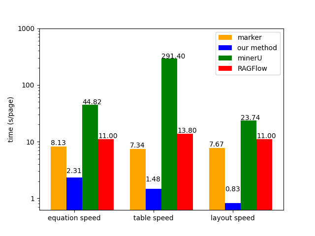

# llm-energy-doc-tool

[简体中文](https://github.com/tsinghua-fib-lab/llm-energy-doc-tool/blob/main/README.md) | English

This tool parses the policy file into a markdown and eventually converts it into a formatted JSON file.

## Workflow

- Layout recognition and saving of pictures
- Formula conversion
- Table conversion
- Text and title conversion
- Save markdown

## Effect

- pdf original file


- markdown


##  Usage

1. `clone` this project：

   ```bash
   git clone https://github.com/tsinghua-fib-lab/llm-energy-doc-tool.git
   ```

2. configure related environments：

   1. Rapid-Layout：

      - Environmental requirements：

        - python 3.11
        - cuda 12.1
        - cudnn 8.9.0.6
        - requirements: see `RapidLayout/requirements.txt`

      - Environment configuration：

        1. creates a python environment under `RapidLayout` , which is assumed to be named `venv`:

           ```bash
           # Use python's own virtual environment
           cd RapidLayout
           python -m venv ./venv
           
           # or use conda
           cd RapidLayout
           conda create -p ./venv python=3.11
           ```
        
        3. Activate the virtual environment, install CUDA 12.1 and cudnn 8.9.0.6, and configure the environment variables;
        
        4. install dependent packages:
        
           ```bash
           # Under RapidLayout directory
           pip install -r requirements.txt
           
           # You may need to replace onnxruntime with onnxruntime-gpu
           pip list | grep onnxruntime #  If onnxruntime-gpu is installed, skip below
           pip uninstall onnxruntime
           pip install onnxruntime-gpu --extra-index-url https://aiinfra.pkgs.visualstudio.com/PublicPackages/_packaging/onnxruntime-cuda-12/pypi/simple/
           ```
      
   2. TexTeller：
   
      - Environmental requirements:：

        - python 3.11
        - cuda 12.1
        - cudnn 8.9.0.6
        - requirements： see `TexTeller/requirements.txt`
   
      - Environment configuration:
   
        1. creates a python environment under `TexTeller` , which is assumed to be named `venv`:

           ```bash
           #  Use python's own virtual environment
           cd TexTeller
           python -m venv ./venv
           
           # or use conda
           cd TexTeller
           conda create -p ./venv python=3.11
           ```
        
        2. Activate the virtual environment, install CUDA 12.1 and cudnn 8.9.0.6, and configure the environment variables;
        
        3. install dependent packages:
        
           ```bash
           # Under TexTeller directory
           pip install -r requirements.txt
           
           # You may need to replace onnxruntime with onnxruntime-gpu
           pip list | grep onnxruntime # If onnxruntime-gpu is installed, skip below
           pip uninstall onnxruntime
           pip install onnxruntime-gpu --extra-index-url https://aiinfra.pkgs.visualstudio.com/PublicPackages/_packaging/onnxruntime-cuda-12/pypi/simple/
   
   3. PaddleOCR：
   
      - Environmental requirements:

        - python 3.11
        - cuda 12.0
        - cudnn 8.9.1
        - requirements： see `PaddleOCR/requirements.txt`
        
      - Environment configuration:
        1. creates a python environment under `PaddleOCR`, which is assumed to be named `venv`:
      
           ```bash
           # Use python's own virtual environment
           cd PaddleOCR
           python -m venv ./venv
           
           # or use conda
           cd PaddleOCR
           conda create -p ./venv python=3.11
           ```
        
        2. Activate the virtual environment, install CUDA 12.0, cudnn 8.9.1 and configure the environment variables;
      
        3. install paddle requirements:
        
           1. according to [1.Environment Preparation](https://github.com/PaddlePaddle/PaddleOCR/blob/main/ppstructure/docs/quickstart_en.md#1-environment-preparation) at [PP-Structure Quick Start](https://github.com/PaddlePaddle/PaddleOCR/blob/main/ppstructure/docs/quickstart_en.md#1-environment-preparation) to prepare the paddle environment；
        
           2. Download Model：
        
              1. in [1. Chinese Detection Model](https://github.com/PaddlePaddle/PaddleOCR/blob/main/doc/doc_en/models_list_en.md#1.1) to download the `ch_PP-OCRv4_server_det` model. Unzip it and place it in the `PaddleOCR/ppstructure/inference` directories；
              2. in [2.1 Chinese Recognition Model](https://github.com/PaddlePaddle/PaddleOCR/blob/main/doc/doc_en/models_list_en.md#21-chinese-recognition-model) to download the `ch_PP-OCRv4_server_rec` model. Unzip it and place it in the  `PaddleOCR/ppstructure/inference` 和 `PaddleOCR/ppocr/inference` directories；
              3. in [2.2 Table Recognition](https://github.com/PaddlePaddle/PaddleOCR/blob/main/ppstructure/docs/models_list_en.md#22-table-recognition) to download the `ch_ppstructure_mobile_v2.0_SLANet` model. Unzip it and place it in the`PaddleOCR/ppstructure/inference`directories；
        
           3. Install other dependent packages
        
              ```bash
              # Under the PaddleOCR directory
              pip install -r requirements.txt
              ```
        
              
        
   
3. start the service：

   1. to start the formula recognition service：
      ```bash
      # Under the TexTeller directory
      python ./src/run_formula_api.py
      ```

   2. to start the table recognition service：
      ```bash
      # Under the PaddleOCR directory
      python ./ppstructure/run_table_api.py
      ```
   3. to start the character recognition service：
      ```bash
      # Under the PaddleOCR directory
      python ./tools/run_text_api.py
      ```
   
4. run:

   1.  modifies the parameters at the following positions in `RapidLayout/parse_policy_layout.py` 

      ```python
      if __name__ == '__main__':
       parse(input_dir="./input_pdf", output_dir="./output")
      ```

   2. run：
   
      ```bash
      # Under the RapidLayout directory
      python parse_policy_layout.py
      ```
   

## Benchmarks

We randomly selected 50 pages containing formulas and tables from a large number of policy documents. Another 50 pages were randomly selected to test the effect of layout recognition. The randomly selected pages and conversion results are shown in the `benchmark/` directory.

We transformed the 150 samples through various tools and checked them manually. The performance of each tool is shown in the figure below:

- Speed

  

- Accuracy


